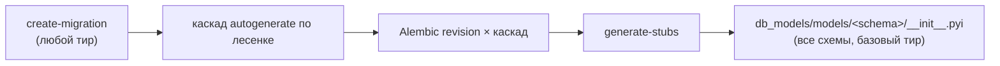
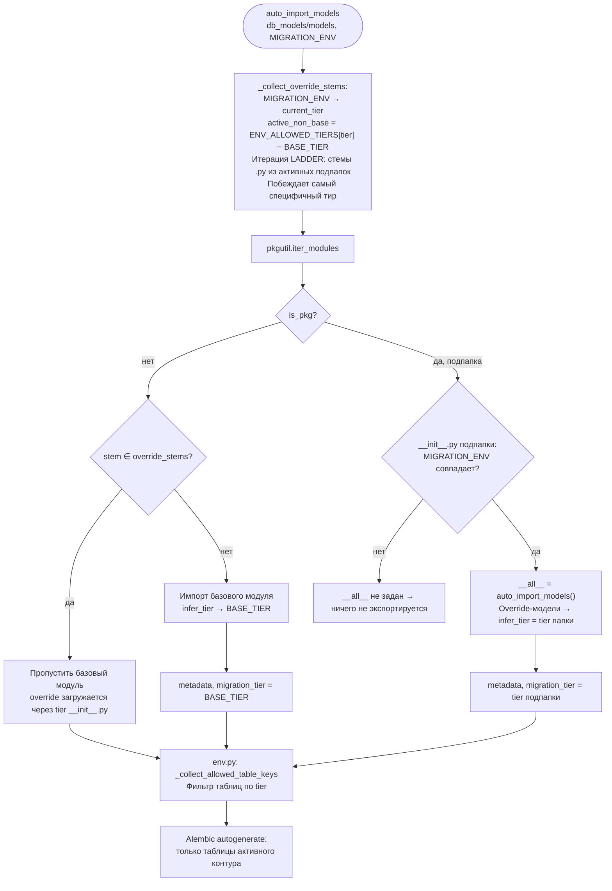
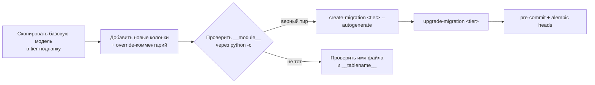

# RUNBOOK

Оперативное руководство по командам и runtime-поведению проекта.

## Содержание

1. [Применение миграций](#применение-миграций)
2. [Создание миграций](#создание-миграций)
3. [Генерация IDE-стабов](#генерация-ide-стабов)
4. [Загрузка моделей и table overrides](#загрузка-моделей-и-table-overrides)
5. [Диагностика](#диагностика)

---

## Применение миграций

```bash
# Рекомендуемый способ (устанавливает MIGRATION_ENV автоматически), кросс-платформенно
upgrade-migration <tier>   # main | dev

# Через Docker Compose
docker compose --profile <tier> up alembic_<tier>

# Напрямую через Alembic
MIGRATION_ENV=<tier> alembic upgrade <tier>@head
```

---

## Создание миграций

```bash
# Autogenerate — требует живой БД на текущем head
create-migration <tier> "описание" --autogenerate

# Manual — без БД, только выбранный контур
create-migration <tier> "описание" --manual
```

При `--autogenerate` с контура `X` каскадно генерируются ревизии для `X` и всех контуров ниже по лесенке (`main` → `dev`). Пустые файлы удаляются автоматически.

---

## Генерация IDE-стабов

`auto_import_models` — динамический механизм: IDE не видит что экспортируется из `db_models.models.<schema>`. Для корректной навигации и автодополнения каждая схема имеет `__init__.pyi` с явными ре-экспортами базового тира.

Стабы генерируются **автоматически** в конце каждого запуска `create-migration` (любой тир, любой режим). Можно также запустить вручную:

```bash
generate-stubs
```

Команда AST-парсит файлы верхнего уровня каждой схемы (базовый тир, без подпапки `dev/`), собирает классы и Core `Table`-переменные и перезаписывает `__init__.pyi`. Коммитьте изменённые стабы вместе с миграцией.



---

## Загрузка моделей и table overrides

### Поток загрузки `auto_import_models`



### Матрица активных подпапок

| `MIGRATION_ENV` | Активные подпапки | Что может быть override |
|---|---|---|
| `main` | — | ничего |
| `dev` | `dev/` | файлы из `dev/` |

### Most-specific-wins

При наличии одного стема в нескольких активных подпапках побеждает тир, стоящий **ниже** по `LADDER`. В двухуровневой лесенке `dev`-файл побеждает базовый:

| Файлы на диске | `MIGRATION_ENV=main` видит | `MIGRATION_ENV=dev` видит |
|---|---|---|
| `dev/bar.py` | базовый `bar.py` | `dev/bar.py` |

В шаблоне это и показано: `example/dev/bar.py` добавляет к `example.bar` колонку `debug_note` только в dev.

### Workflow создания table override



---

## Диагностика

### Проверить загрузку модели по контурам

```bash
for env in main dev; do
  echo -n "$env: "
  MIGRATION_ENV=$env python -c "from db_models.models.<schema> import <ModelClass>; print(<ModelClass>.__module__)"
done
```

### Проверить что автоген базового тира чистый

```bash
create-migration main "check" --autogenerate
# Если пустой — файл удалится автоматически. Это ожидаемо.
```

### Проверить heads

```bash
alembic heads
# Ожидаемо: по одному head на каждый активный контур (main, dev)
```

### Pre-commit

```bash
pre-commit run --all-files
```
